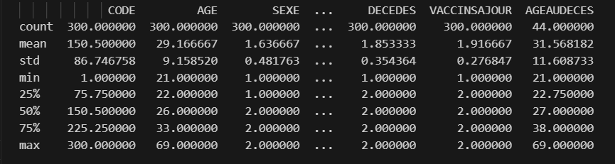
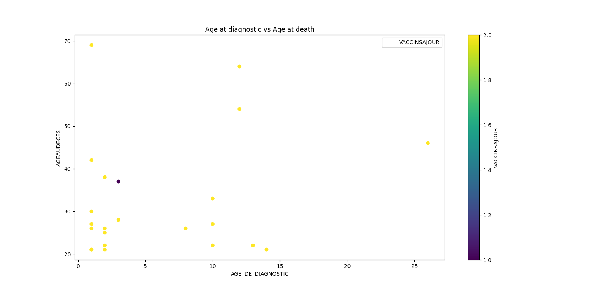
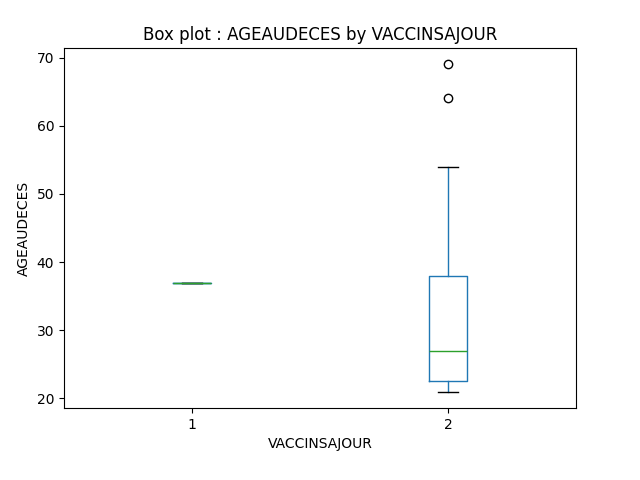
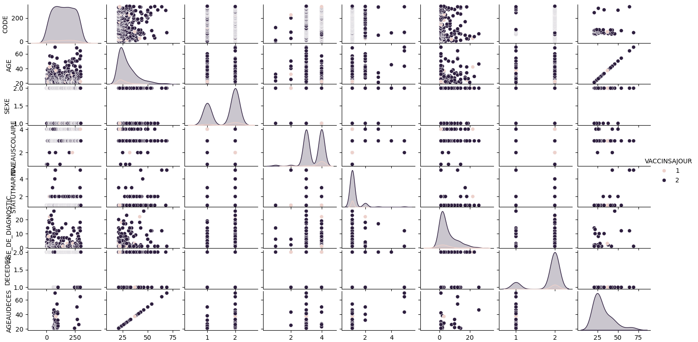
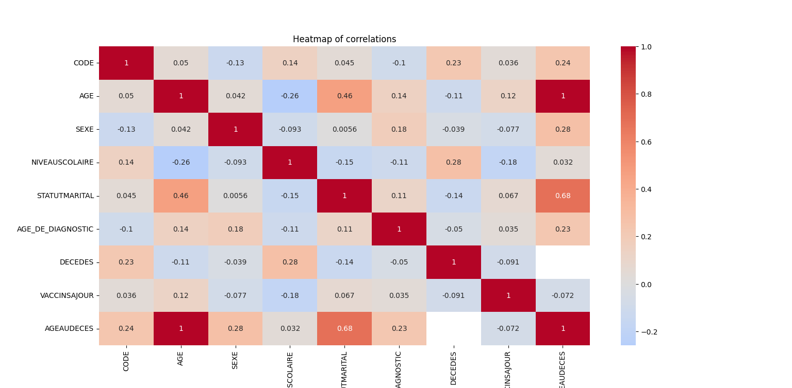
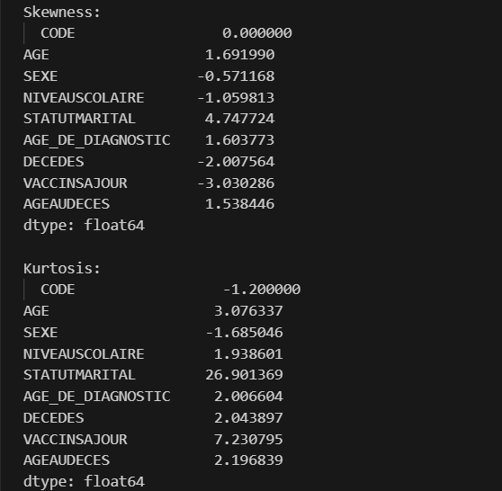
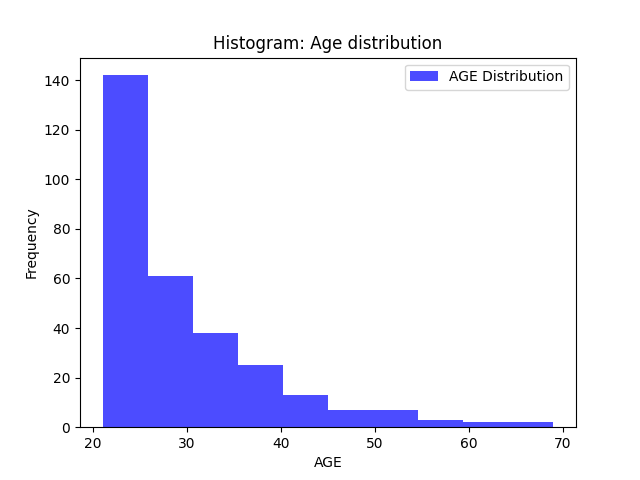
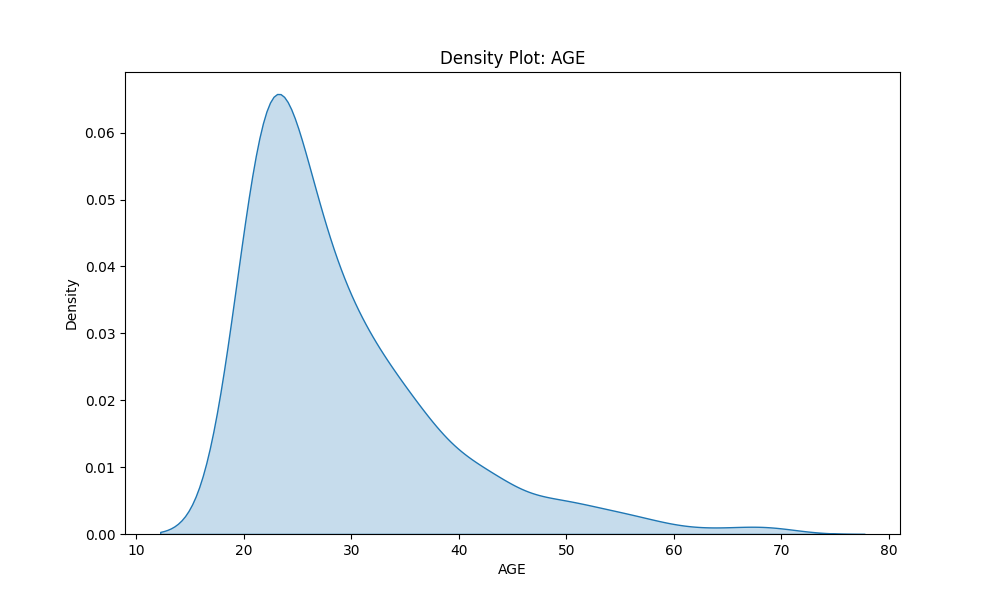
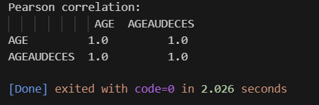
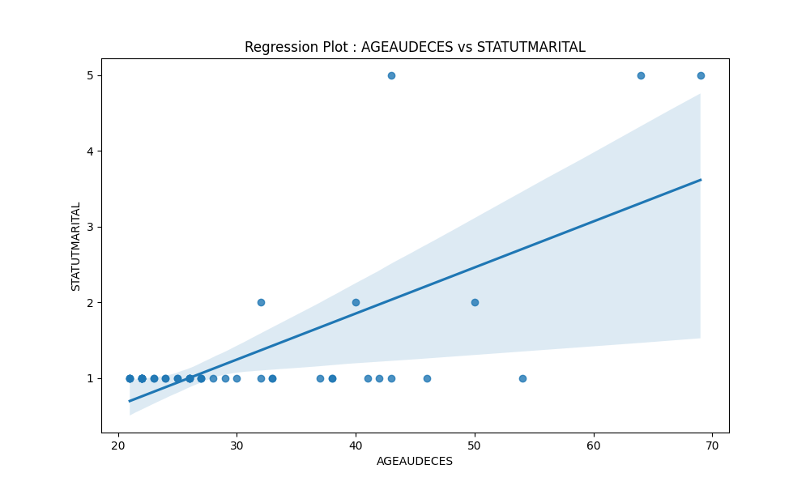

<h1> PLAN D'ANALYSE DES DONNEES DE CETTE ETUDE </h1>

Pour réaliser une courbe de survie des patients drépanocytaires en fonction des statuts vaccinaux avec détermination de la p-value, les variables nécessaires dans votre jeu de données incluront :

1. **ID du Patient** : Un identifiant unique pour chaque patient.
2. **Temps de Suivi** : La durée de suivi pour chaque patient (en mois, jours, ou années).
3. **Événement de Survie** : Une variable binaire indiquant si l'événement de survie (décès ou une autre condition d'intérêt) s'est produit (1) ou non (0) pendant la période de suivi.
4. **Statut Vaccinal** : Une variable indiquant le statut vaccinal des patients (vacciné ou non vacciné).
5. **Date de Début du Suivi** : La date à laquelle le suivi du patient a commencé.
6. **Covariables Potentielles** : D'autres variables cliniques ou démographiques qui pourraient influencer la survie (âge, sexe, type de drépanocytose, traitements reçus, comorbidités, etc.)

Avec nos variables, nous allons utiliser des méthodes statistiques telles que l'analyse de survie de Kaplan-Meier pour estimer la courbe de survie, et le test du log-rank pour comparer les courbes de survie entre les groupes de patients vaccinés et non vaccinés, ce qui permettra de déterminer la p-value associée à cette comparaison.

Pour aller plus loin, nous allons envisager d'utiliser un modèle de régression de Cox (Cox proportional hazards model) pour ajuster les effets d'autres covariables sur la survie et obtenir des estimations plus robustes.

# 1. Determination des covariables

Identifier les covariables importantes dans notre jeu de données est crucial pour obtenir des résultats précis et robustes dans vos analyses statistiques. Voici les étapes et méthodes que nous allons utilisés pour déterminer l'importance des covariables :

## 1.1. **Exploration Préliminaire des Données**

- Cliquez sur `*code*` pour vous rendre vers l'analyse exploratoire des données [code](obj1.py#L4-L29)
- Résumé Statistique : Nous avons utilisés des fonctions comme `describe()` de pandas pour obtenir un résumé statistique de vos données.

```python
# Loading cleaned dataset
df = load_cleaned_data()

# Filter key variables
df = df[['CODE', 'AGE', 'SEXE', 'NIVEAUSCOLAIRE', 'STATUTMARITAL', 'ETHNIE', 'AGE_DE_DIAGNOSTIC', 'DECEDES', 'VACCINSAJOUR',
            'AGEAUDECES']]

# Preliminary exploration of dataset

# Summarize the descriptive analysis
print(df.describe())
```

**Resultats**


- Visualisation : Nous avons utiliser des graphiques comme les diagrammes de dispersion et les boîtes à moustaches pour visualiser les relations entre les variables

<u>**Interprétation**</u>

> Nous pouvons voir du résumé de l'analyse descriptive les éléments suivants :
>
> - Un total de **300** patients sous étude
> - une moyenne d'âge de **29 ans**
> - L'âge minimal est **21 ans** et l'âge maximal est **69 ans**
> - Les quartiles de l'âge sont **26(22 ; 33)**
> - L'intervalle interquartile de l'âge est
> - mode :
> - Ecart-type :
> - Variance :

### 1.1.1. Diagramme de Dispersion (Scatter Plots)

Le diagramme de dispersion a été utilisé pour visualiser la relation entre deux variables continues qui sont l'age auquel le patient a été diagnostiqué et l'age de décès du patient.

```python
# Draw a scatter plot to visualize the distribution of 2 continuous variables
scatter_plot(df, 'AGE_DE_DIAGNOSTIC', 'AGEAUDECES', "Age at diagnostic vs Age at death", var3="VACCINSAJOUR")
```

**Resultats**


<u>**Interprétation**</u>

>Nous pouvons remarquer aucune corrélation entre l'âge au décès des patients et l'âge au diagnostic

### 1.1.2. Boîtes à Moustaches (Box Plots)

La boîte à moustaches a été utilisée pour visualiser la distribution d'une variable continue (Age au décès) et identifier les valeurs aberrantes.

```python
# Draw a box plot to visualize the distribution of one variable and identify outliers
box_plot(df, 'AGEAUDECES', 'VACCINSAJOUR')
```

**Resultats**


### 1.1.3. Matrice de diagramme de dispersion (Pair Plots)

Elle a été utilisée pour visualiser les relations par paires dans un jeu de données entier.

```python
# Draw a pair plot
seaborn(df, 'VACCINSAJOUR')
```

**Resultats**


### 1.1.4. Heatmap

Il a été utilisé pour visualiser les corrélations entre toutes les variables continues.

```python
# Draw a Heatmap plot
heatmap(df.drop(columns='ETHNIE'))
```

**Resultats**


<u>**Interprétation**</u>
> Nous pouvons remarquer une légère corrélation entre l'âge au décès des patients et leur statut marital, une corrélation positive parfaite entre l'âge des patients et l'âge au décès

## 1.2 Analyses Univariées

Nous avons réalisés des statistiques descriptives et des visualisations univariées courantes pour évaluer les caractéristiques de chaque variable dans notre jeu de données.

### 1.2.1. Analyse Statistic Descriptive

Nous avons utilisés les fonctions `skewness() et kurtosis()` de pandas pour la mésure des formes que prennent les différentes variables d'intérêt de notre jeu de données.

```python
# Descriptive analysis
print("Skewness:\n ", df.drop(columns='ETHNIE').skew())
print("Kurtosis:\n ", df.drop(columns='ETHNIE').kurtosis())
```

Resultats


<u>**Interprétation**</u>
> Nous pouvons remarquer une asymétrie positive (skewness > 0) pour l'âge, statut marital, âge de diagnostic et l'âge au décès. Une asymétrie négative (skewness < 0) pour le sexe, niveau scolaire, statut de décès et statut vaccinal. Uniquement le code présente un symétrie dans le jeu des données.

### 1.2.2. Histogrammes

Un diagramme d'histogramme sera utiliser pour visualiser la distribution de l'age des patients.

```python
# Draw a histogram to visualize the distribution of a continuous variable
histogram(df, 'AGE', "Histogram: Age distribution")
```

**Resultats**


### 1.2.3. Diagrammes de densité (Density plot)

Les diagrammes de densité (ou kernel density estimates, KDE) va servir à estimer la distribution de probabilité d'une variable continue.

```python
# Draw a density plot to estimate the probility distribution of a continuous variable
density_plot(df, 'AGE')
```

**Resultats**


<u>**Interprétation**</u>
> La courbe de distribute de la variable d'intérêt "âge" montre une asymétrie

## 1.3 Analyses Bivariées

Suite à la rémarque d'une potentiel corrélation entre l'âge au décès des patients et leur statut marital, nous avons réaliser une analyse bivariée sur ces variables. Pour ce faire nous avons utilisé réaliser un diagramme de dispersion avec régression.

### 1.3.1 Calcul des coefficients de corrélation de Pearson

Nous nous sommes servis du ce calcul pour affirmer l'existence d'une corrélation entre l'âge des patients et l'âge au décès.

```python
# Coefficient of Correlation
# Coefficient of correlation of Pearson
pearson_corr = df[['AGE', 'AGEAUDECES']].corr(method='pearson')
print("Pearson correlation:\n", pearson_corr)
```

Resultats


<u>**Interprétation**</u>
> D'après le resultat ci-dessus nous pouvons confirmer une forte corrélation entre l'âge des patients et l'âge du décès des patients. Nous allons suppresser la variable "âge au décès" pour avoir un meilleur modèle.

### 1.3.2 Diagramme de Dispersion avec Régression (Regression Plots)

Ce diagramme nous a aidé à visualiser la tendance linéaire entre l'âge au décès des patients et leur statut marital.

```python
# Regression plot
# Draw a regression plot to visualize linear trend between marital status and death age cause the heatmap had shown a slight relation between these variables
regression_plot(df, 'AGEAUDECES', 'STATUTMARITAL')
regression_plot(df, 'AGE', 'AGEAUDECES')
```

Resultats


<u>Interpretation</u>
> Nous pouvons voir d'après le diagramme ci-dessus une faible présence des observations ou patients dans la zone de corrélation précisement cinq patients uniquement. Cela montre une faible corrélation entre ces variables. Néanmoins cette analyse n'est pas très fiable car ce diagramme n'est pas parfaitement adapté pour des variables catégorielles.

## 1.4 Modèles de Regression

Pour évaluer la corrélation entre la variable dépendante (statut de décès) et les covariables, nous avons utilisés deux régressions notamment la régression logistique et la régression de Cox.

### 1.4.1 Régression Logistique
